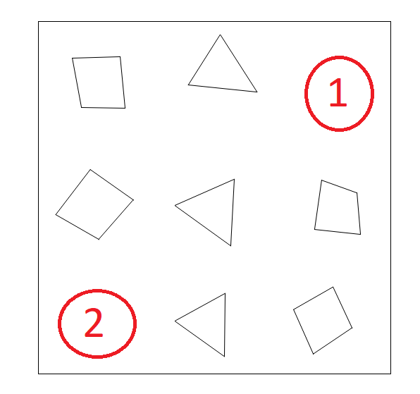

# Имитационная модель дуэли двух.... треугольников на плоскости

На плоской карте сражаются два треугольника - зелёный (Вы) и красный (противник). Каждый треугольник может двигаться вперед/назад, вращаться вокруг своей оси и стрелять, а также менять свою область видимости (желтая область). При попадании снарядов (красных кружков) в треугольник у него убавляется здоровье. Треугольник может выдержать 2 попадания, при попадании третьего попадания треугольник погибает и дуэль заканчивается. Побеждает выживший треугольник, или по истечении 7000 игровых секунд выигрывает треугольник с бОльшим количеством здоровья.


## Установка и запуск

Для запуска имитационной модели необходимо скачать все файлы из этого каталога


... и установить все необходимые зависимости (все три). Они находятся в файле `requirements.txt` и установить их можно, выполнив команду:

```
pip install -r requirements.txt
```

После этого имитационную модель можно запустить, выполнив скрипт `main.py`:
```
python main.py
```
Дуель можно ставить на паузу клавишей `пробел`


## Описание модели

Дуэль происходит на квадратной карте размером 50 х 50 с препятствиями, через которые нельзя передвигаться, стрелять и видеть.
В начальный момент времени Вы располагаетесь или в зоне 1, или в зоне 2. Ваш противник появляется в другой, свободной зоне (или в 1, или во 2). 



Далее, каждую 0.1 секунду внутреннего (игрового) времени происходят "шаги" имитационной модели. На каждом шаге каждый треугольник может передвинуться, повернуться, изменить свою зону видимости или выстрелить (в т.ч. одновременно). А может ничего не делать). Что делать конкретно - решать Вам. Для этого необходимо написать свою функцию управления. В файле `main.py` приведен пример создания имитационной модели, где Ваш треугольник ничего не делает (его поведение продиктовано функцией `foo`), а треугольник противника совершает случайные действия:

```python
from engine import Engine, random_behaivor

def foo(input_dict):
    # Ничего не делать
    return {}

im = Engine.get_standart(you_brain_foo=foo, enemy_brain_foo=random_behaivor)
while not im.done:
    info = im.step(render=True)
result = im.get_result()
print(result)
``` 

Вместо функции `foo` можно (и нужно) написать свою функцию, которая управляет Вашим треугольником лучше. Эта функция вызывается на каждом шаге имитационной модели, и ей на вход передается один аргумент - словарь с информацией о состоянии Вашего треугольника и о положении объектов, попадающих в Вашу область видимости. Вернуть же эта функция должна тоже словарь, но с набором команд, которые должен выполнить треугольник на текущем шаге.

Пример словаря, который подается на вход функции управления:
```python
# input_dict
{'alpha': 26.768147523745625,  # [градусы] угол, между горизонтальной осью карты и осью треугольника
 'can_shoot': True,            # флаг, показывающий можно ли выстрелить на данном шаге
 'enemies': [],                # список кортежей с информацией об относительном положении видимых противников
 'hp': 3,                      # текущее количество здоровья
 'name': 'you',                # имя треугольника
 'r_vis': 15.0,                # текущая максимальная длина лучей видимости
 'rays_intersected': [9.438252206577435,   # длина лучей видимости после их пересечений с препятствиями
                      12.302776513481309,
                      15.0,
                      12.312821889940892,
                      15.0,
                      15.0,
                      15.0,
                      12.423756652519886,
                      13.990505472669568,
                      15.0],
 'rounds': [],                 # список кортежей с информацией об относительном положении видимых снарядов
 'step_count': 112,            # номер шага имитационной модели
 'theta': 90,                  # [градусы] половинный угол сектора области видимости
 'time': 11.2                  # текущее игровое время
}
```
Данный словарь описывает следующее состояние треугольника (индексы 0,1...9 соответствуют индексам в списке 'rays_intersected'):


Однако, если в область видимости попадает противник, то поле 'enemies' в словаре заполняется кортежем (относительный угол, относительное расстояние) до видимого противника. Аналогично передаются относительные положения видимых снарядов в список 'rounds'.
```python
# input_dict
{'alpha': 30,
 'can_shoot': False,
 'enemies': [(33.1907321579596, 11.488824537391338)], # противник находится в 11.49 метрах от нас; линия визирования образует с осью треугольника угол 33.19 градусов
 'hp': 3,
 'name': 'you',
 'r_vis': 15.0,
 'rays_intersected': [9.833332633952942,
                      13.248413218510313,
                      14.999999999999998,
                      10.751612465196567,
                      12.992620882432915,
                      14.999999999999998,
                      14.999999999999998,
                      15.000000000000002,
                      14.481208665614448,
                      14.999999999999998],
 'rounds': [(-2.4426166246761056, 7.600000000000001),  # то же и с видимыми снарядами
            (51.86188850530426, 11.348178141415987)],
 'step_count': 176,
 'theta': 90,
 'time': 17.59999999999998}
```


Что касается возвращаемого значения, то функция управления должна возвращать словарь вида:

```python
{'move': 0.7,    # скорость на текущем шаге (где 1 - полный вперёд, -1 - полный назад) 
 
 'rorate': -0.1, # скорость вращения на текущем шаге 
                 # (1 - поворот против часовой стрелки с максимальной скоростью, -1 - по часовой)
 
 'vision': 1,    # скорость изменения угла видимости 
                 # (1 - увеличение угла видимости с максимальной скоростью, -1 - уменьшение)
 
 'fire': 1}      # попытаться сделать выстрел на данном шаге, если это возмнжно, 
                 # если нет перезарядки (1 - сделать выстрел)
```

Словарь может содержать все эти поля, а может содержать только их часть:
```python
{'vision': -0.2,
 'fire': 1}      
```
... а может и вовсе быть пустым 
```python
{}      
```

Команды выдаются в обезразмеренном виде от -1 до 1, а треугольник совершает действия со следующими скоростями:

 - максимальная линейная скорость 1 м/с (игровой метр на игровую секунду);
 - максимальная скорость поворота треугольника 20 град/с;
 - максимальная скорость изменения угла видимости 20 град/с;
 - минимальное время между выстрелами 5 с.

 
При изменении угла видимости площадь зоны видимости не изменяется, т.е. при уменьшении угла видимости радиус видимости увеличивается. При одновременной подаче сигнала 'move' и 'rotate' треугольник сначала поворачивается на половину угла поворота, потом передвигается линейно на заданное расстояние и дальше поворачивается еще на половину угла.

При выстреле создается новый движущийся со скоростью 2 м/с снаряд, направление которого определяется текущей зоной видимости треугольника. Чем уже зона видимости, тем меньше разлёт выпущенных снарядов. Конкретный угол направления движения снаряда определяется розыгрышем случайной величины. Случайная величина распределена по нормальному закону с МО, совпадающем с осью треугольника, и СКО = theta / 3
